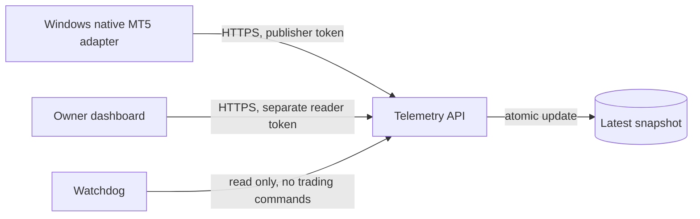

# Private demo telemetry — prepared, not deployed

This package receives a small, strictly validated XAUUSD **demo** snapshot from a Windows terminal adapter. It stores one latest row and serves a private dashboard view. It contains no broker login, order endpoint, execution switch, or automatic recovery that can trade. The requested v0.2 backtest/walk-forward baseline must pass before any later demo activation. This preparation does not imply that the baseline has passed.

Two deployment alternatives share the same validation and HTTP code:

The first alternative is a **dedicated, approved Supabase project**, with a native Deno Edge Function and Postgres. The second is the local Docker architecture template: Postgres, internal PostgREST, Node telemetry, and a watchdog. Neither has been provisioned or started by this work. Do not reuse an unrelated existing database.

## HTTP and authentication

| Request | Authorization | Response |
| --- | --- | --- |
| `POST /functions/v1/vortex-live` | Publisher Bearer token | Accepted, duplicate, or conflict |
| `GET /functions/v1/vortex-live` | Separate reader Bearer token | Private latest snapshot or empty state |
| `GET /functions/v1/vortex-live/quotes` | None, **disabled by default** | Explicit quote-only projection when enabled |

Local equivalents are `/` and `/quotes`. Tokens belong in the `Authorization` header only; query strings are rejected. Generate two independent random 32-byte tokens, represented as 64 lowercase hexadecimal characters. Hash the exact UTF-8 token string using SHA-256. `functions/vortex-live/config.template.mjs` contains placeholders for the two hashes. Copy it into a **private deployment bundle** as `config.mjs`; the repository ignores that file. Invalid or identical hashes fail closed.

The publisher token stays with the private Windows uploader. The reader token is entered by the owner and retained only in browser memory for the current view; never embed it in a static asset, URL, Git file, or persistent browser storage. This bearer-token design is a single-owner access mechanism, not multi-user login. Rotating the corresponding hash invalidates that token immediately after redeploy. The UI integration must still be implemented and verified separately.

All responses use `Cache-Control: private, no-store`. Browser CORS permits only `https://vortex-xau.vercel.app`; requests without an Origin header are permitted for authenticated server clients. CORS is not an authentication control. Public quotes, when explicitly enabled, expose only symbol, bid, ask, tick time, and freshness metadata—never account, positions, strategy, scores, or journal.

POST accepts UTF-8 JSON up to 128 KiB, including requests without a trustworthy Content-Length. Compression, extra fields at every object level, unsafe numbers, invalid dates, and real-account mode are rejected. Do not log request bodies, bearer values, or upstream failures.

## Snapshot contract, schemaVersion 1

All keys below are required unless marked optional. Top-level keys are `schemaVersion`, `mode`, `sessionId`, `sessionStartedAt`, `sequence`, `producedAt`, `quote`, `status`, `account`, `positions`, `strategy`; optional `signal` and `v02` are supported. Unknown keys are rejected.

- `schemaVersion: 1`, `mode: "demo"`; `sessionId` is a UUID, fixed for one producer process. `sequence` is a nonnegative JavaScript-safe integer increasing on each publication. `sessionStartedAt` stays fixed through that process.
- UTC times are ISO strings with `Z`, either second precision or exactly three millisecond digits. `producedAt` must be no more than 120 seconds old or 30 seconds ahead of the receiver clock. It cannot precede process start. Synchronize producer and server clocks.
- `quote`: null, or `{symbol:"XAUUSD", bid, ask, changedAtUtc}` with positive prices and ask ≥ bid. An old tick is allowed across closed sessions; the frontend must display its actual age. Optional `brokerTimeServer` is a naive `YYYY-MM-DDTHH:mm:ss`, accompanied by `brokerTimeBasis:"broker_server_unknown_offset"`. Never relabel an unverified broker clock as UTC.
- `status`: booleans `terminalConnected`, `algoTradingEnabled`, `eaRunning`, `demoVerified`. If `demoVerified` is false, account and quote must be null and positions empty. A verified snapshot requires a USD account object. This flag asserts what the trusted adapter checked; the cloud cannot independently authenticate an MT5 account.
- `account`: null or `{currency:"USD", balance, equity, freeMargin, margin}`. Amounts are finite USD; margin is nonnegative. Negative equity/free margin is preserved if reported by the broker.
- `positions`: up to 20 records with `{id, side, lots, openPrice, currentPrice, profit}`, plus optional nullable `stopLoss` and `takeProfit`. IDs are unique 64-character SHA-256 digests; use session-salted local identifiers, never broker ticket/login values. Side is `buy` or `sell`; missing broker stops use null rather than zero.
- `strategy`: `{name, version, state, runnerMode}`, optional `reason`. Name has uppercase `VORTEX` prefix, version is bounded, state/reason are bounded machine codes, and runnerMode is `observe` or `armed`. Reporting `armed` does not activate anything in this API.
- Optional **top-level** `signal`: `{decisionTimeServer, sessionUtcOffsetMinutes, ready, direction, atr, consensus, scores}`. The offset may be null until verified. Direction is -1/0/1 and must be 0 if not ready. Ready requires non-null ATR, consensus, and six scores. Scores are lowercase `orion`, `vortex`, `nova`, `luna`, `kira`, `atlas`, each in [-100,100]. Non-ready values may be null. Signal server time is not treated as UTC.

## Optional v0.2 dashboard contract

`v02` is an optional top-level object. This extends the transport without pretending that v0.1 reports contain v0.2 observations. The object has these exact keys:

| Field | Contract |
| --- | --- |
| `model` | Exact `VORTEX-XAU-EXTREME-v0.2` |
| `environment` | `PAPER` or `DEMO`; never `REAL` |
| `mode` | `NORMAL`, `AGGRESSIVE`, `EXTREME`, `FROZEN`, `KILL` |
| `action` | `LONG`, `SHORT`, `WAIT` |
| `metrics` | All keys present, each finite number or null: balance, equity, floatingPnl, realizedPnl, dailyPnl, dailyDrawdown, maxDrawdown, freeMargin, usedMargin, openRisk, lockedProfit, currentR |
| `context` | session, atr, volatilityState, nextNews |
| `engines` | Exactly six lowercase named objects: orion, vortex, nova, luna, kira, atlas |
| `consensus` | Number [-100,100] or null |
| `protection` | confirmed: boolean/null; killSwitch: boolean; latencyMs: nonnegative number/null; brokerConnected and dataFresh: boolean |
| `journal` | At most 50 records `{time,event,reason}`, ascending UTC timestamps, bounded safe strings |
| `position` (optional) | Null or `{averageEntry,sl,tp1,tp2,runnerLots,pyramidCount}` |

Metrics use **USD**, except dailyDrawdown/maxDrawdown which are fractions [0,1] and currentR which is a multiple of initial risk. `openRisk` is USD, not percent. Used margin, open risk and locked profit are nonnegative. Unknown metrics remain null; they are not substituted with zero. When the terminal has not been verified as demo, all v02 metrics must be null and v02 position absent/null.

Session is `ASIA`, `LONDON`, `NEWYORK`, `LONDON_NEWYORK`, or `OTHER`, matching `research_v02/vortex_v02/data.py`; null means unavailable. ATR is positive or null. Volatility state and next-news text are nullable, bounded safe text; neither is generated by the cloud. Each engine contains `{score,status,reason}`: score is nullable [-100,100], except KIRA [0,100]; status is PASS/FAIL/INVALID, and PASS/FAIL require a score. These are heuristic scores, not probabilities. Position prices and runnerLots may be null; pyramidCount is an integer 0..3.

## Ordering, restarts, and freshness

`schema.sql` performs one atomic `INSERT ... ON CONFLICT` update. Within a session, sequence must increase and production time cannot go backward. A new session can take over only if its start is **strictly later than the previous accepted production time**. Its sequence may restart at zero. Retired processes cannot regain ownership simply by sending a higher sequence. Run one producer, stop it before restarting, and preserve clock synchronization; an ambiguous same-millisecond restart fails closed.

An exact retry returns `duplicate` without changing server `receivedAt`. A conflicting/older update returns HTTP 409. The uploader should retry the same payload after a transient network failure, then publish fresh data; never loop forever on a 409 or replay an expired payload. An authentic payload older than the 120-second ingestion limit is rejected, including an old retry.

GET returns `state: empty`, `fresh`, or `stale`. More than 90 seconds since producer or server receipt marks the heartbeat stale. `ageSeconds` refers to snapshot production, **not the age of the market tick**. The quote has its own `changedAtUtc`, and terminal/protection statuses remain distinct. A fresh snapshot can truthfully report a disconnected terminal or an old weekend quote.

The database is a latest-value store, not an execution journal or durable trade history. Keep full producer and broker journals separately in private storage. Server `receivedAt` is generated in SQL; clients cannot supply it.

## Supabase deployment preparation

1. Select a dedicated project only after the parent task's approval and baseline gates permit proceeding. Apply `schema.sql` once, then run `verify.sql` and the project's security advisors. It is a schema draft rather than a fabricated migration history. Use the current Supabase migration workflow when promoting it.
2. Build a private function bundle containing `index.mjs`, `core.mjs`, `store.mjs`, and populated `config.mjs`. Keep live config out of Git. Configure `verify_jwt = false` as shown in `config.toml`, because this API validates opaque Bearer tokens itself. Disabling the gateway JWT check without deploying the custom checks would leave an unsafe endpoint.
3. The Edge adapter reads only platform-provided `SUPABASE_URL` and legacy `SUPABASE_SERVICE_ROLE_KEY`. The latter remains on the server and is sent only to the configured HTTPS PostgREST origin. Redirects are prohibited. No broker credential is required.
4. Verify unauthenticated and wrong-role requests are rejected, authenticated demo ingestion/read works, retries do not refresh receipt time, and public quotes remain disabled. Remote Edge/PostgREST integration is still pending; local checks do not prove a live deployment.

The table has RLS and FORCE RLS enabled, with no public-client policies. Table and function permissions are revoked from PUBLIC, anon, and authenticated. Only service_role receives explicit table access and RPC EXECUTE. The function is SECURITY INVOKER, not SECURITY DEFINER. This accounts for Supabase's change that new tables no longer automatically grant service-role API access.

## Local Docker architecture template

`compose.template.yml` is a reviewable alternative, not an installation on the 2 GB Windows VPS. The MT5 adapter stays Windows-native. Choose a separate Linux Docker host if using this sidecar stack.

Supply reviewed Node 24, PostgreSQL, and PostgREST image references pinned by digest through `NODE_IMAGE`, `POSTGRES_IMAGE`, and `POSTGREST_IMAGE`; placeholders prevent accidental startup. Prepare private files named in Compose: database password, separate PostgREST login password, populated PostgREST config, telemetry hash config, and reader token. The two PostgREST password copies must match, with URI escaping in its config file. Use a fresh database volume for initialization; these scripts do not alter an existing database.

Only telemetry binds a host port, at **127.0.0.1:8181**. Postgres and PostgREST have no host ports and live on an internal network. Local PostgREST intentionally uses service_role as its internal anonymous role; it must never be exposed through a public port/proxy. The watchdog is on a separate internal network and has only the reader token. Before any remote Windows uploader connection, add an approved HTTPS ingress; do not transmit tokens over public HTTP or broaden the port binding casually.

The watchdog records only state transitions—fresh/stale/empty/unavailable/unverified/disconnected—and has no broker API or Docker socket. Docker restart policies recover crashed containers; health checks report health but do not automatically restart merely unhealthy containers. The watchdog does not restart the trading process, infer a profit, or issue an order. Volumes and backups remain operator responsibilities. No Docker images were pulled and no containers were started in this task.

## Verification performed

With Node 24, run `npm ci --ignore-scripts` followed by `npm test` inside `cloud/`. Runtime Edge/local telemetry has no third-party JavaScript dependencies; PGlite 0.5.8 is pinned solely for embedded-Postgres tests. The dependency-free HTTP checks can run with `node --test tests/core.test.mjs`.

The suite covers nested data rejection, role separation, body caps, timestamp honesty, private/public separation, stale display, v0.2 nullable fields, actual SQL role denial, atomic session ordering, and server-side retry timestamps. The SQL tests execute the actual schema in embedded Postgres rather than reproducing its logic in JavaScript. They do not exercise distributed concurrent PostgREST requests or Supabase's gateway. A remotely deployed project must still pass integration checks before use.

Primary references checked for this preparation: [Supabase function configuration](https://supabase.com/docs/guides/functions/function-configuration), [Edge secrets](https://supabase.com/docs/guides/functions/secrets), [RLS](https://supabase.com/docs/guides/database/postgres/row-level-security), [new-table grant change](https://supabase.com/changelog/45329-breaking-change-tables-not-exposed-to-data-and-graphql-api-automatically), [PostgREST configuration](https://postgrest.org/en/stable/references/configuration.html), and [PGlite](https://pglite.dev/docs/).
